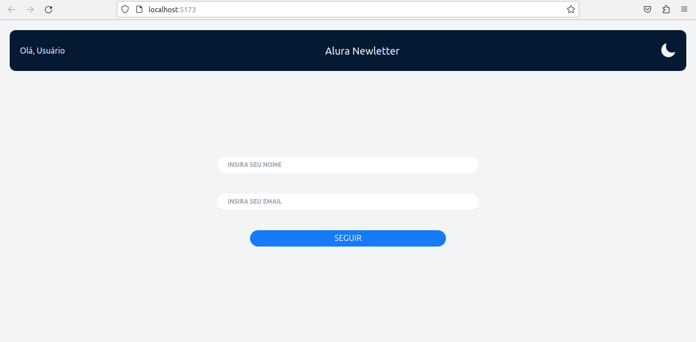

# Boas-vindas ao repositório do projeto de NewsLetter! 🚀

Link Deploy: https://georgia-rocha.github.io/newsletter

<strong>Para clonar e testar</strong>
 

1. Clone o repositório
* `git clone git@github.com:georgia-rocha/newsletter.git`
* Entre na pasta do repositório que você acabou de clonar:

2. Instale as dependências:
* `npm install`

3. Iniciar a aplicação na sua máquina:
  * `npm run dev`

## O que foi desenvolvido

Neste projeto foi desenvolvido um modelo de blog informativo com cards! Ao utilizar essa aplicação, a pessoa usuária é capaz de:  fazer o login e acessar o blog;
- Foi desenvolvido toda parte de estilização com tailwind e a funcionalidade com JS (React Componests);
- Também foi usado PropTypes;

## Objetivo 👩‍🎓

Utilizar o apredizado passado pela Alura no curso de React com TailwindCSS: estilizando componentes, que inclue:
- React;
- Renderização de componentes;
- Desenvolver aplicações mobile first e responsivas por padrão;
- Criar componentes de classe em React estilizados e extensivos;
- Desenvolva um padrão de design flexível e performático;
- Fazer uso de PropTypes para validar as props de um componente.
- Usar o index.css com o layer e o apply para melhorar a legibilidade do código e deixa-lo mais performático;

## Requisitos 📚

- [x] 1. Criar os componentes;
- [x] 2. Montar a Aplicação;
- [x] 3. Instalar o Tailwind;
- [x] 4. Aplicar as estilizações nos componentes;
- [x] 5. Deixar responsivo;
- [x] 6. Criar Dark Mode;
- [x] 7. Renderizar o componentes;
- [x] 8. Usar o layer e o apply no index.css;
